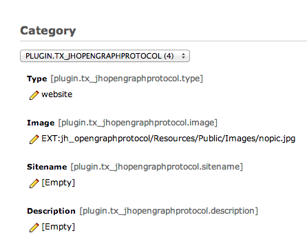
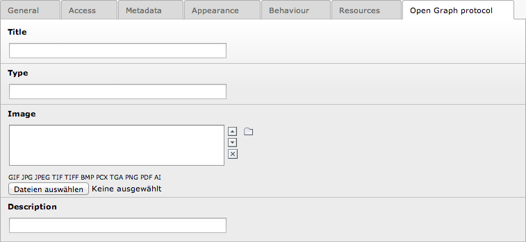
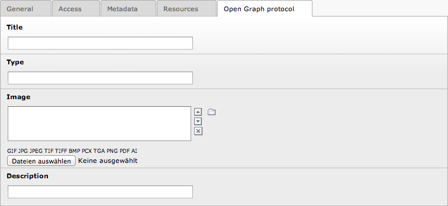

.. ==================================================
.. FOR YOUR INFORMATION
.. --------------------------------------------------
.. -*- coding: utf-8 -*- with BOM.

.. include:: ../Includes.txt

.. _introduction:

Introduction
============

.. _what-it-does:

What does it do?
----------------

The jh\_opengraphprotocol extension adds some Open Graph protocol
properties as meta-tags to the html-header. The following properties
are supported:

- title

- type

- image

- url

- site\_name

- description

- locale

For more information about the Open Graph protocol see:
`https://developers.facebook.com/docs/opengraphprotocol/
<https://developers.facebook.com/docs/opengraphprotocol/>`_ or
`http://ogp.me/ <http://ogp.me/%20>`_

.. _screenshots:

Screenshots
-----------

Constants-Editor for global settings:

Page properties for local settings:

Alternative page language for local settings:

   
.. _contributionAndIssues

Contribution and Issues
-----------------------

The extension has been moved from TYPO3 forge to GitHub.

Please use the GitHub repository to report issues. 
Pull-request to enhance the extension are welcome, too.

`GitHub repository for EXT:jh\_opengraphprotocol
<https://github.com/jonathanheilmann/ext-jh_opengraphprotocol>`_

.. _sponsoring

Sponsoring
----------

Developing an extension requires time and time is money. As developer
I am proud to create open source products. But without money nothing
I can not buy any bread.

So if you think that this is a great extension feel free to by me a
beer or a coffee via paypal: `https://www.paypal.com/cgi-
bin/webscr?cmd=\_s-xclick&hosted\_button\_id=Y7NQU2N8W8CEC
<https://www.paypal.com/cgi-bin/webscr?cmd=_s-
xclick&hosted_button_id=Y7NQU2N8W8CEC>`_